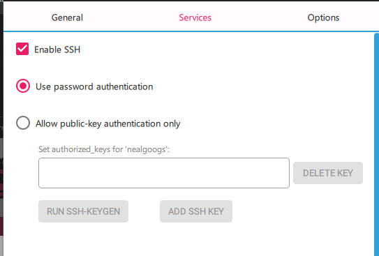

# GUnitFinalProject
CCSU final project robot ai class

Hardware Needs:
MicroSD card
Wifi Dongle


Software Needs:
Raspberry Pi Imager
https://www.raspberrypi.com/software/

Step 1: Insert microSD card into computer.
Step 2: Use Raspberry Pi Imager
Choose device, either pi 3 or pi 4
Choose OS


Step 3: Yes edit settings


Fill in the username and password and configure wireless LAN info of your wifi. Make sure Hidden SSID is not checked.


Under services tab



Then write to MicroSD card.

Step 4: Insert microsd card into rasp pi. Make sure robot is set up and has power and wifi dongle is in usb slot. Give it 2 to 3 minutes to boot up.

step 5: open up youre terminal. Run this command ssh `<username>`@raspberrypi.local

Step 6: Make sure pi is updated with this

``` bash
sudo apt update && sudo apt upgrade -y
sudo reboot
```

________________________________________________
Installing ROS2

Run these commands

```sudo apt install -y software-properties-common
sudo add-apt-repository universe

sudo apt update && sudo apt install -y curl gnupg2 lsb-release

sudo curl -sSL https://raw.githubusercontent.com/ros/rosdistro/master/ros.key \
  -o /usr/share/keyrings/ros-archive-keyring.gpg

echo "deb [arch=$(dpkg --print-architecture) signed-by=/usr/share/keyrings/ros-archive-keyring.gpg] \
http://packages.ros.org/ros2/ubuntu $(lsb_release -cs) main" \
| sudo tee /etc/apt/sources.list.d/ros2.list
```

No GUI Tools

`sudo apt install -y ros-jazzy-ros-base`

If you want GUI  with these tools Full Desktop (Rviz, Gazebo, Tools) Run this command instead
`sudo apt install -y ros-jazzy-desktop`

Add ROS environement to shell
```
echo "source /opt/ros/jazzy/setup.bash" >> ~/.bashrc
source ~/.bashrc
```

Test Installation
`ros2 -h`

Other testing

One one terminal run this command
`ros2 multicast receive`

and on another terminal run this command
`ros2 multicast send`

_________________________________________________________________________
Installing GoPiGo

Run this command

```
sudo apt install -y python3-pip python3-rpi-lgpio python3-smbus i2c-tools git pigpio-tools python3-pigpio
git clone https://github.com/DexterInd/GoPiGo3.git
```

CD into GoPiGo3/Software/Python
`sudo pip3 install --break-system-packages -e .`

Add permissions so you dont have to sudo everytime
```
sudo usermod -aG i2c,gpio,plugdev $USER
sudo reboot
```

Then to deal with DI_Sensors issues

`git clone https://github.com/DexterInd/DI_Sensors.git ~/DI_Sensors`

cd into DI_Sensors/Python/

`sudo pip3 install --break-system-packages -e .`

Finally copy the wasd.py file and test

